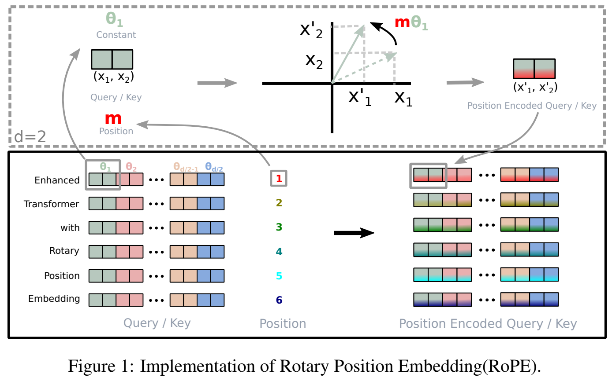

## Position Encoding
- [Blog | 让研究人员绞尽脑汁的 Transformer 位置编码](https://kexue.fm/archives/8130)
- [Blog | Positional Encoding by lil](https://lilianweng.github.io/posts/2023-01-27-the-transformer-family-v2/#positional-encoding)

### Learned Position Encoding (BERT/GPT2)
- 简单地将 absolute position 作为 key 查询 embedding
- 缺点：位置编码没有泛化性，或者说没有自带外推性，需要通过一些 [trick](https://kexue.fm/archives/7947) 来处理

---

### Relative Position Encoding

TODO

---

### Sinusoidal Position Encoding

- 原始 Attention Paper 做法

$$
\text{PE}(k, 2i) = \sin(\frac{k}{10000^{2i/d}})  \\
\text{PE}(k, 2i+1) = \cos(\frac{k}{10000^{2i/d}})
$$

其中 d 表示位置编码的维度，k 表示位置，$i \in [0, d/2]$。显式的生成规律，期望有一定的外推性。同时由于

$$
\sin(a+b) = \sin(a)\cos(b) + \cos(a)\sin(b)  \\
\cos(a+b) = \cos(a)\cos(b) - \sin(a)\sin(b)
$$

即 **a+b 位置的向量可以表示为 a 位置向量 和 b 位置向量的组合，提供了表达相对位置信息的可能性**。

---

### RoPE

- [Paper | RoFormer: Enhanced Transformer with Rotary Position Embedding](https://arxiv.org/abs/2104.09864)
- [Blog | Rotary Embeddings: A Relative Revolution](https://blog.eleuther.ai/rotary-embeddings/)
- [Blog | Transformer 升级之路：2、博采众长的旋转式位置编码](https://kexue.fm/archives/8265)

#### 做法



- 将二维向量当成复数 \
  假设 q 和 k 是只有两维的向量，Attention 里面核心的操作是求 qk 的内积 $\boldsymbol{q} \cdot \boldsymbol{k}$

  将 q k 分别看成复数（第一维对应实部，第二维对应虚部）$\boldsymbol{q_c}$ 和 $\boldsymbol{k_c}$，则 **qk 的内积等于 $\boldsymbol{q_c}$ 和 $\boldsymbol{k_c}$ 的共轭复数乘积的实部**
  $$\boldsymbol{q} \cdot \boldsymbol{k} = \text{Re}[\boldsymbol{q_c}\boldsymbol{k_c}^{*}]$$

  推导如下
  
  $$\boldsymbol{q_c} = q_0 + q_1 i$$
  
  $$\boldsymbol{k_c}^{*} = k_0 - k_1 i$$
  
  $$\boldsymbol{q_c}\boldsymbol{k_c}^{*} = (q_0 k_0 + q_1 k_1) + (q_1 k_0 - q_0 k_1)i$$
  
  $$\text{Re}[\boldsymbol{q_c}\boldsymbol{k_c}^{*}] = q_0 k_0 + q_1 k_1 = q \cdot k$$

- 引入绝对位置信息，对复数**进行旋转操作**  \
  假设 q k 对应的位置分别为 m, n，将复数 $\boldsymbol{q_c}, \boldsymbol{k_c}$ 乘上 $e^{im\theta}, e^{in\theta}$。从位置编码的角度，这一步是将 q k 各自的绝对位置信息加入到编码中；从复数运算的角度看，效果相当于在复平面上将向量分别旋转 $m\theta$ 和 $n\theta$

- 旋转后的内积包含相对位置信息  \
  重新计算经过旋转之后的复数对应的向量（记为 $q'$ 和 $k'$）的内积
  
  $$q' \cdot k' = Re[(\bf{q_c} e^{im\theta})(\bf{k_c} e^{in\theta})^{*}] = Re[\bf{q_c}\bf{k_c}^{*} e^{i(m-n)\theta}]$$
  
  可以看到旋转后向量的内积里出现了 q 和 k 的相对位置信息 m-n，这个正是我们希望的。RoPE **通过对 q 和 k 以一种巧妙的形式引入绝对位置信息，使得内积带上了相对位置信息**。可以进一步展开看看旋转后的内积与相对位置信息 m-n 的关系：
  
  $$\boldsymbol{q_c}\boldsymbol{k_c}^{*} = (q_0 k_0 + q_1 k_1) + (q_1 k_0 - q_0 k_1)i$$
  
  $$e^{i(m-n)\theta} = \cos{((m-n)\theta)} + \sin{((m-n)\theta)}i$$
  
  $$\text{Re}[\boldsymbol{q_c}\boldsymbol{k_c}^{*} e^{i(m-n)\theta}] = (q_0 k_0 + q_1 k_1)\cos{((m-n)\theta)} - (q_1 k_0 - q_0 k_1)\sin{((m-n)\theta)}$$

- 写成矩阵形式  \
  将复数乘 $\boldsymbol{q_c}, \boldsymbol{k_c}$ 乘 $e^{im\theta}, e^{in\theta}$ 写成矩阵乘法形式，以 q 为例

```math
$$
\begin{bmatrix} q_0' \\ q_1' \end{bmatrix}
=\begin{bmatrix}
\cos{m\theta} & -\sin{m\theta} \\ \sin{m\theta} & \cos{m\theta}
\end{bmatrix}
\times
\begin{bmatrix} q_0 \\ q_1 \end{bmatrix}
=
\begin{bmatrix}
q_0 cos{m\theta} & -q_1\sin{m\theta} \\ q_0\sin{m\theta} & q_1\cos{m\theta}
\end{bmatrix}
$$
```

- 扩展到多维  \
  内积满足线性叠加性，因此任意偶数维的 q k，我们都可以表示为二维情形的拼接（线性叠加性指高维 qk 的内积等于多个二维 qk 内积相加，通过这样拆组->旋转->拼接后的 qk 内积仍是 m-n 的函数）

```math
$$
\begin{equation}
\begin{bmatrix} q_0' \\ q_1' \\ \vdots \\ q_{d-2}' \\ q_{d-1}' \end{bmatrix}
=
\underbrace{
\begin{bmatrix}
\cos{m\theta_0} & -\sin{m\theta_0} & \dots & 0 & 0 \\
\sin{m\theta_0} & \cos{m\theta_0} & \dots & 0 & 0 \\
\vdots & \vdots & \ddots & \vdots & \vdots \\
0 & 0 & \dots & \cos{m\theta_{d/2-1}} & -\sin{m\theta_{d/2-1}}  \\
0 & 0 & \dots & \sin{m\theta_{d/2-1}} & \cos{m\theta_{d/2-1}} \\
\end{bmatrix}}_{\boldsymbol{R_m}}
\times
\begin{bmatrix} q_0 \\ q_1 \\ \vdots \\ q_{d-2} \\ q_{d-1} \end{bmatrix}
\end{equation}
$$
```

  即给位置为 m 的向量 q 乘上矩阵 $\boldsymbol{R_m}$、位置为 n 的向量 k 乘上矩阵 $\boldsymbol{R_n}$，变换后的 q',k' 的内积结果就自动包含相对位置信息了

- 高效实现  \
  由于旋转矩阵非常稀疏，直接用矩阵乘法比较低效，可以写成 elemwise 点乘的形式
  
```math
$$
\begin{bmatrix} q_0' \\ q_1' \\ \vdots \\ q_{d-2}' \\ q_{d-1}' \end{bmatrix}
=
\begin{bmatrix} q_0 \\ q_1 \\ \vdots \\ q_{d-2} \\ q_{d-1} \end{bmatrix}
\otimes
\begin{bmatrix} \cos{m\theta_0} \\ \cos{m\theta_0} \\ \vdots \\ \cos{m\theta_{d/2-1}} \\ \cos{m\theta_{d/2-1}} \end{bmatrix}
+
\begin{bmatrix} -q_1 \\ q_0 \\ \vdots \\ -q_{d-1} \\ q_{d-2} \end{bmatrix}
\otimes
\begin{bmatrix} \sin{m\theta_0} \\ \sin{m\theta_0} \\ \vdots \\ \sin{m\theta_{d/2-1}} \\ \sin{m\theta_{d/2-1}} \end{bmatrix}
$$
```

#### RoPE 的特点
- 乘性 Sinusoidal: RoPE 形式上和 Sinusoidal 位置编码有点相似，只不过 Sinusoidal 位置编码是加性的，而 RoPE 可以视为乘性的
- 远程衰减: 沿用了 Sinusoidal $\theta_i=10000^{-{2i/d}}$，有远程衰减性，即**随着 qk 相对位置的拉大，qk 内积会变小**
