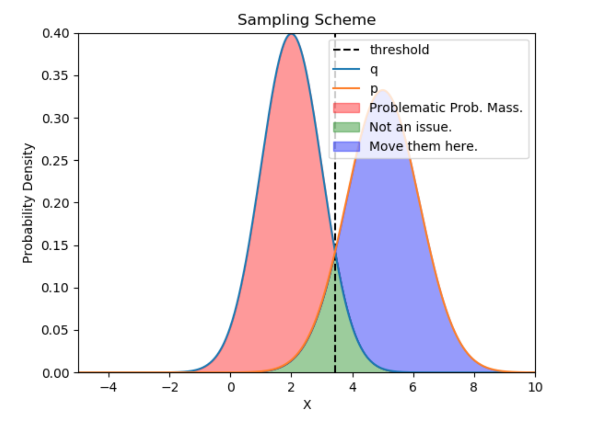

### Speculative Sampling

实现了 DeepMind 在 [Accelerating Large Language Model Decoding with Speculative Sampling](https://arxiv.org/pdf/2302.01318.pdf) 提出大模型推理加速方法 Speculative Sampling。

- autoregressive 类的生成模型在推理时新 token 的生成依赖于前面的 token，因此必须一个一个 token 生成，一次模型 forawrd pass 只能生成一个 token。Speculative Sampling 核心思想是用一个更小但更快的 draft model 生成一个 draft token 序列，然后将原始输入序列拼上 draft 序列一起送入目标模型进行推理，得到目标模型在这些 draft token 上的概率分布，进而可以对 draft token 逐一进行检验，如果draft token 猜对了，就可以直接跳到下个 token，如果猜错了，那么后续的 draft token 就丢掉，从当前位置开始重新一轮的 sampling

- 对比 autoregressive 从做到右一个一个生成的方式和 speculative sampling
  - autoregressive sampling 每一轮生成一个 token，计算代价是一次目标模型 forward pass
  - speculative sampling 每一轮要花费更多的计算，计算代价是一次目标模型 forward pass（序列稍长），在加上 K 次 draft 模型的 forward pass。但是每一轮可以生成不止一个 token，取决与当前 context 下 draft 模型的 target 模型输出的匹配程度，最多可以生成 K 个 token

- 根据 DeepMind 的 report，在实际使用中 speculative sampling 会有 ~2x 的加速（当然加速比与 draft model 的选择、具体推理的内容有关）。说明使用 draft model 带来的加速能够 cover 住 draft 模型的 forward 带来的额外开销。之所以使用 draft model 也能猜中一些 token，是因为在自然语言中，有一些 token 的组合是比较常出现的（比如一些固定短语搭配等），这时 draft model 比较容易就能猜到，而常规的版本还是通过昂贵的 forward 来生成这些简单的 token，通过这样的方式来实现加速。

- 具体实现上，对于某个位置的 T，我们知道 target model 和 draft model 在这个位置上的 next word prediction 概率分布 p 和 q，也知道 draft model 最后选择了 x，借鉴拒绝采样的思想，可以知道当前要接受这个 x 的概率为 `min(1, p[x]/q[x])`，如果拒绝了这个采样，则需要从 `normalized max(0, p-q)` 分布中 resample 一个 token，并且重新开始新的一轮 speculative sampling。如果这一轮中 K 个 draft token 都被接受，则最后再从最后一个分布中采样得到新的 token，然后开始新的一轮。

- 为什么拒绝采样后需要从 `normalized max(0, p-q)` 分布中 resample？因为这样的 scheme 能够保证整个 sampling 过程是等价于直接从目标模型进行采样的。公式的推导可以见论文附录的 Theorem 1 Proof。直觉的理解可以见[这篇文章](https://www.mlsys.ai/papers/speculative_decoding.html)。下图中 p 和 q 分别是 target model 和 draft model 的预估分布，我们希望的是通过 q 分布采样来近似 p 分布的采样，当 x 落在绿色区域，表示我们接受了这个采样，没有问题。当 x 落在红色区域时，这样的 x 我们是不想要的。此时为了能够近似 p 的分布，我们需要拒绝这次采样，然后再从紫色区域进行重采样。（紫色区域即为 `max(0, p-q)`。这种 sampling scheme 在 greedy sampling 和更通用的 stochastic sampling 下都能够保证等价于直接从 p 进行采样。

  

- naive 拒绝采样方法就是先从 B 采样得到数据点 x，然后分别计算 `p(x|A)` 和 `p(x|B)，对 p(x|B)` 进行缩放使其在定义域上所有分布 B 的值都大于分布 A 的值（B 的 PDF 整个罩住了 A 的 PDF），假设这个缩放系数是 C，此时 C*p(x|B) 一定是大于等于 p(x|A) 的，此时接受 x 的概率为 `p(x|A) / (C*p(x|B))`。如果拒绝这个采样则重新回到上面的步骤，对 B 进行采样，然后判断。Speculative Sampling 中对拒绝采样做了一些修改，主要是为了支持 greedy sampling。在 greedy sampling 情况下，target model 和 draft model 的概率分布是一个 one-hot 的概率分布，因此无法按照原始的拒绝采样将 draft model 的分布进行 scale 使其能够 cover 住 target model 的概率分布。

- Google 在 2018 年的这篇文章 [Blockwise Parallel Decoding for Deep Autoregressive Models](https://proceedings.neurips.cc/paper/2018/file/c4127b9194fe8562c64dc0f5bf2c93bc-Paper.pdf) 里就提出了类似的思路，不过不是用一个独立的 draft model 来生成 candidate tokens，而是直接在主网络建模预估后一个 token，后两个 token，...，因此推理时 forward 可以并行得到一系列 token，然后进行校验。不过仅支持了 greedy sampling。[Fast Inference from Transformers via Speculative Decoding](https://arxiv.org/pdf/2211.17192.pdf) 这边文章是独立于 DeepMind 的工作，基本思路一致。

### resources
- [Blog Post by mlsys.ai](https://www.mlsys.ai/papers/speculative_decoding.html)
- [Blog Post by HuggingFace](https://huggingface.co/blog/assisted-generation)
- [tweet by Karpathy](https://twitter.com/karpathy/status/1697318534555336961)
- [github repo - jaymody](https://github.com/jaymody/speculative-sampling)
